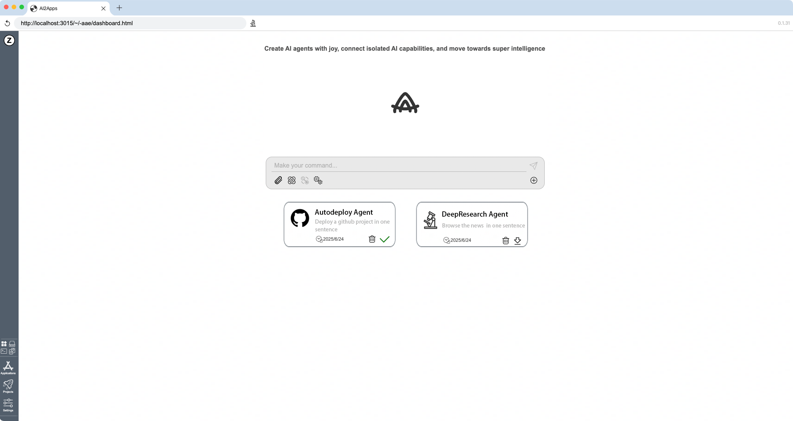

# AI2Agent

<!-- ## Getting Started -->

## AutoDeploy Agent

We only need one sentence to use the `AutoDeploy Agent` to deploy the github open-source project for us.

### Install Agent

To install `AutoDeploy Agent`, we need to click the download icon in `AutoDeploy Agent` moudle. If a green icon is displayed, it indicates that the agent has been successfully installed.

### Use Agent

AutoDeploy Agent video

### Update Agent

To update `AutoDeploy Agent`, we need to click the update icon in `AutoDeploy Agent` moudle. If a green icon is displayed, it indicates that the agent has been successfully updated.

### Delete Agent

To delete `AutoDeploy Agent`, we need to click the delete icon in `AutoDeploy Agent` moudle.

<!-- ### DeepResearch Agent

We only need one sentence to use the `DeepResearch Agent` to browse the latest news and information.

#### Install Agent

To install `DeepResearch Agent`, we need to click the download icon in `DeepResearch Agent` moudle. If a green icon is displayed, it indicates that the agent has been successfully installed.

#### Use Agent

DeepResearch Agent video

#### Update Agent

To update `DeepResearch Agent`, we need to click the update icon in `DeepResearch Agent` moudle. If a green icon is displayed, it indicates that the agent has been successfully updated.

#### Delete Agent

To delete `DeepResearch Agent`, we need to click the delete icon in `DeepResearch Agent` moudle. -->

## Build Agent

If you want to build an agent yourself, you can refer to the [AgentBuilder](https://github.com/Avdpro/ai2apps/tree/main/agents/AgentBuilder) codes, which is the core codes that implement agent.

## Get More

If you want to get more details about AI2Agent, please see [Ai2Apps](https://github.com/Avdpro/ai2apps/blob/main/README.md).

